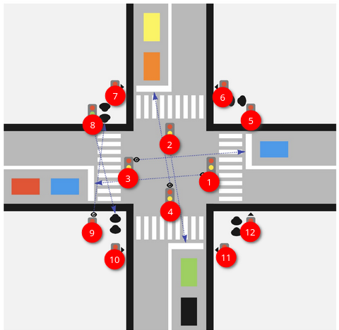

# Адаптивный алгоритм регулировки движения на перекрестке
## Введение
1. Имеется сгенерированная документация (doxygen) к самым важным методам алгоритма.
2. Имеется adaptive_alg.pdf, в котором наглядно представлена последовательность изменения состояний (Stage).
## Псевдокод алгоритма
```cpp
while(true): /*Начинаем с пешеходной стадии, зелёный цвет сигнала активен*/
    if (next_stage == VEHICLE) {
        next_stage.update() /*Обновляем длительность следующей стадии*/
        next_stage.switch_traffic_lights_colors() /*Активируем желтый сигнал следующей стадии*/
        sleep(YELLOW_LIGHT_DURATION)
        active_stage.switch_traffic_lights_colors() /*Начинаем текущий цикл сначала (включаем красный)*/
        active_stage = next_stage /*Переключаем активную стадию на следующую*/
        active_stage.switch_traffic_lights_colors() /*Включаем зеленый сигнал*/
        sleep(active_stage.duration() - YELLOW_LIGHT_DURATION)
    }
    else if (next_stage == PEDESTRIAN) {
      next_stage.update(); /*Обновляем длительность следующей стадии*/
      next_stage.switch_traffic_lights_colors() /*Включаем зелёный, потому что жёлтого сигнала нет*/
      active_stage.switch_traffic_lights_colors() /*Начинаем текущий цикл сначала (включаем красный)*/
      active_stage = next_stage; /*Переключаем активную стадию на следующую*/
      sleep(active_stage.duration() - YELLOW_LIGHT_DURATION)
    }
```
## Разметка id светофоров

